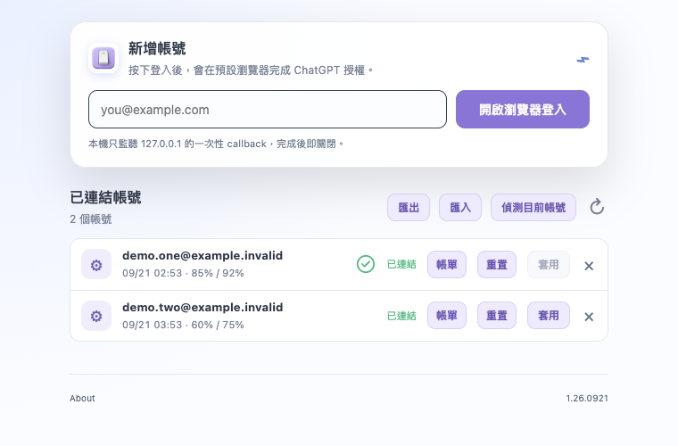
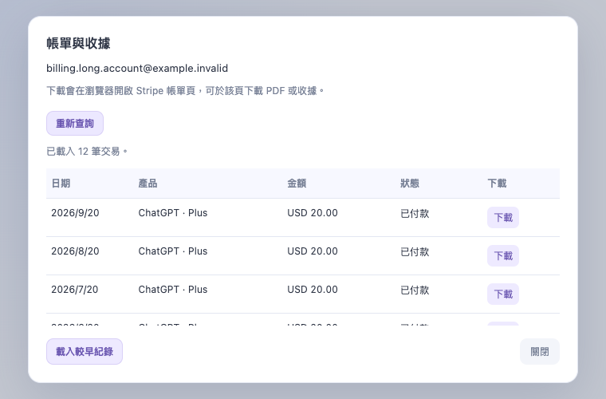

# CodexSwitch

CodexSwitch 是 macOS 上的 Codex 帳號管理工具，讓你在多個 Codex 帳號之間快速切換。

近期變更見 [更新紀錄](CHANGELOG.md)，開發與驗證摘要見 [專案文件](docs/README.md)。

## 操作介面

上圖為模擬資料示意。

## 功能與特色

- 管理多個 Codex 帳號
- 一鍵套用指定帳號
- 套用前只關閉相同 `CODEX_HOME` 的 Codex App，保留其他獨立實例
- 匯入與匯出帳號列表
- 偵測所有執行中的 Codex 實例，依帳號與目錄分別標示使用中，可同時顯示多個勾選
- 顯示帳號連結狀態與下一次自動重置時間
- 背景更新 **帳號剩餘用量**，以「五小時 / 七天」百分比呈現，缺少資料顯示 `-`
- 支援 **用量重置操作**
- 按帳號查詢帳單、分頁查看交易，並開啟 Stripe 帳單頁下載 PDF 或收據
- 支援 Codex 環境設定與帳號資料安全保存
- 相同帳號資料目錄只允許一個 CodexSwitch 實例，避免多開覆寫資料
- 按鈕說明泡泡可隨時開關
- 記住視窗尺寸與位置，支援 macOS 快捷鍵
- 明亮、簡潔、緊湊的介面

## 快速編譯與開始

雙擊 `run.command` 即可啟動 CodexSwitch。第一次使用時，按下「開啟瀏覽器登入」完成帳號登入。

在帳號列表中按「套用」，即可切換到指定帳號。CodexSwitch 會先確認 Codex App 狀態，完成後啟動對應帳號。

## 下載與更新

從 [最新 Release](https://github.com/VaderChen/CodexSwitch/releases/latest) 下載 DMG，開啟後將 CodexSwitch 拖入「應用程式」。目前發布 Apple Silicon（`arm64`）版本。

本文件描述目前原始碼功能；已發布安裝包的功能請以對應 Release 說明為準。

DMG 檔名格式為 `CodexSwitch-1.YY.MMDD-build-HHmm-arm64.dmg`，例如 `CodexSwitch-1.26.0916-build-0917-arm64.dmg`。正式版本經 Developer ID 簽署與 Apple 公證，Release 同時提供 `PACKAGES-SHA256SUMS` 校驗檔。

App 啟動後會在背景自動檢查更新，有新版時在主畫面提示；也可從「關於」對話框手動檢查。下載時顯示百分比、已下載大小及進度條，關閉「關於」仍可在主畫面查看。私人倉庫需先透過 `gh auth login` 登入有讀取權限的 GitHub 帳號。

若前次更新留下備份，會在確認目前 App 簽章後，將舊備份保留於 App 同層的 `.codexswitch-backup-*` 目錄，再繼續更新；剛建立的備份需等待 90 秒，避免與前次安裝程序衝突。

「關於」的紅字「強制更新」會直接下載並安裝最新正式版，即使版本相同或目前為較新的本機版也會重裝。下載校驗、簽章與 Apple 安全驗證仍會執行。

## 帳號用量與設定

- 帳號列日期顯示五小時、七天用量中，最近一次即將到來的自動重置時間；沒有有效時間時顯示 `-`。
- 將游標移至帳號，可查看兩種用量各自的自動重置時間。
- 用量重置需長按 2 秒，會使用帳號可用的重置次數。
- 齒輪設定可指定每個帳號的 `CODEX_HOME` 與 `USER_DATA_DIR`；留空會填入系統預設值，下次套用生效。

## 帳單查詢與下載

按帳號列的「帳單」，再按「查詢帳單」，即可查看交易日期、產品、金額與付款狀態；「載入較早紀錄」可繼續分頁。「重新查詢」會重新讀取最新紀錄。開啟對話框不會自動查詢。

上圖為模擬資料示意。

按交易右側的「下載」會在預設瀏覽器開啟該筆 Stripe 帳單頁，再由頁面下載 PDF 或收據。沒有有效帳單連結的交易會停用下載。下載識別碼只在 App 記憶體中保存，10 分鐘後失效；出現失效提示時請重新查詢。

查詢使用該帳號儲存的 ChatGPT OAuth 登入與工作區；若設定目錄已有相同帳號、相同工作區的新憑證，會使用該憑證。API key 或不完整登入資料無法查詢，登入過期會提示重新登入。帳單與連結不寫入帳號檔或一般紀錄。

此功能參考 [LoadBalanceProvider](https://github.com/VaderChen/LoadBalanceProvider) 的交易紀錄 API 與 Stripe 下載流程；實作與驗證紀錄見 [帳單功能紀錄](docs/billing-2026-09-21/README.md)。

管理訂閱、停止續訂與取消方案僅為探索測試項目，未納入正式功能。

## 移除帳號

按帳號列右側的「×」，會顯示包含帳號名稱的確認對話框。按「確認移除」才會刪除 CodexSwitch 儲存的該帳號登入資料；按「取消」或 Escape 可返回。移除後列表會更新，連續點擊不會重複刪除；失敗時顯示錯誤並允許重試。

此操作只移除 CodexSwitch 的帳號紀錄，不會登出已執行的 Codex，也不會刪除該帳號設定的目錄。

匯出檔案不可選擇目前使用中的帳號資料檔或鎖定檔，以免破壞資料保存與多開防護。

所有對話框開啟時，Tab／Shift+Tab 只會在對話框內切換焦點；關閉後回到原按鈕。

## 多實例切換

- 每個獨立 Codex 實例應使用不同的 `CODEX_HOME` 與 `USER_DATA_DIR`。
- 按「偵測目前帳號」會讀取所有執行中的實例；帳號及兩個目錄皆符合時顯示勾選，並停用該列的「套用」。
- 套用時只關閉相同 `CODEX_HOME` 的實例；沒有對應實例時直接啟動，不需要先開啟 Codex。
- 共用 `CODEX_HOME` 的實例會一起關閉，避免同時讀寫被替換的登入憑證。
- 不同 `CODEX_HOME` 若共用同一個 `USER_DATA_DIR`，會停止套用並提示設定獨立目錄。
- 目錄會依實際檔案身分與磁碟的大小寫規則比對，包含符號連結；輸出檔案路徑衝突時會在關閉 Codex 前停止套用。
- 若無法確認對應程序身分或讀取其環境，會提示處理，不會任意關閉其他實例。

## 建置與封裝

macOS 開發環境使用 **Go 1.27.1** 與 Xcode Command Line Tools。`src/go.mod` 指定最低工具鏈版本；執行 `./build.command` 產生 `dist/CodexSwitch.app`。建置會先在暫存目錄完成編譯與檢查，成功後才將舊 `dist` 暫存為 `dist.bak` 並替換；替換完成即移除備份。若已有 `dist.bak`，請先確認或還原該備份再建置。

編譯失敗會保留原有產物；`run.command` 也會等建置成功才重新啟動 App。執行 `python3 tests/build_safety.py` 可在隔離目錄驗證這些行為。

在 `src` 執行 `go test -race ./...`、`go vet ./...` 與 `go mod verify` 可驗證 Go 程式。前端以 `node --test tests/*.test.cjs tests/*.browser.cjs` 驗證，需可載入 `playwright` 套件，預設使用 Microsoft Edge；可透過 `PLAYWRIGHT_CHANNEL` 指定其他已安裝的 Chromium 通道。

路徑測試預設使用系統暫存磁碟；將 `CODEX_SWITCH_CASE_TEST_ROOT` 指向已掛載、可寫入且區分大小寫的磁碟，可同時驗證兩種檔案系統。

`pack.command` 為本機維護的簽署與封裝腳本，不包含在 GitHub 倉庫。發布 DMG 放在 `dist`，打包完成後移除中繼資料。從 GitHub 取得原始碼後，請使用 `build.command` 建置，或直接下載 Release。
